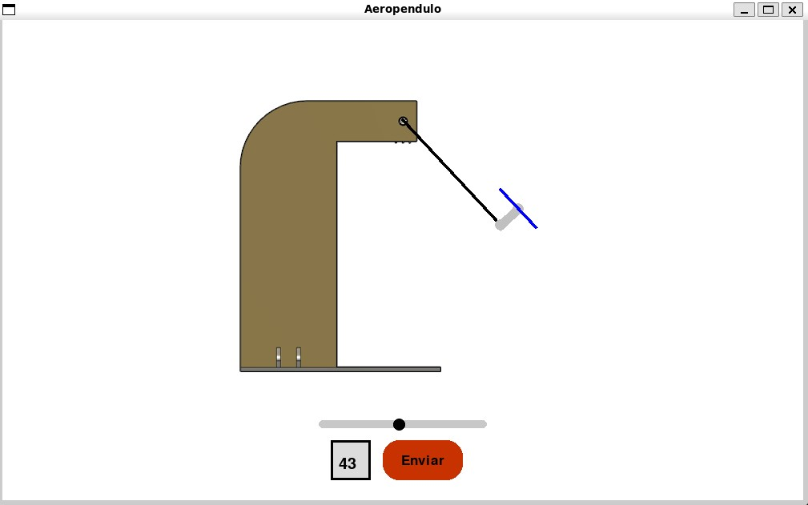

# SEII-aeropendulo
Trabalho Final 1 da Disciplina de Sistemas Embarcados II

O trabalho tem como objetivo a implementação de simulação utilizando a linguagem Python para realizar a dinâmica de um Aeropêndulo e do seu respectivo sistema de controle. Tal implementação foi realizada por meio da biblioteca Pygame e envolveu a simulação das leis físicas, modelagem dinâmica e técnicas de controle.


## Simulação


Para criação da simulação utilizamos da biblioteca pygame para criação dos gráficos e, para a lei de controle numpy e scipy.

## Sistema Físico

Além disso, a construção e implementação do sistema em um modelo físico, utilizando um esp32, ponte h L295N, um potenciômetro para medir o ângulo e um motor, como pode ser observado no video a seguir:

https://user-images.githubusercontent.com/40905287/223845123-b2372783-46e0-4b50-8a32-b04b06849604.mp4


## Como rodar o projeto
1 - Clone o repositório e certifique-se de quem o python instalado no seu computador
```bash
git clone https://github.com/ooiuri/SEII-aeropendulo.git
```

2 - Entrar no repositório
```bash
cd SEII-aeropendulo
```

2 - Instalar as dependências
```bash
pip install -r requirements.txt
```

3 - Executar o script do pygame
```bash
python3 airpendulum.py
```


